<p align="center">
  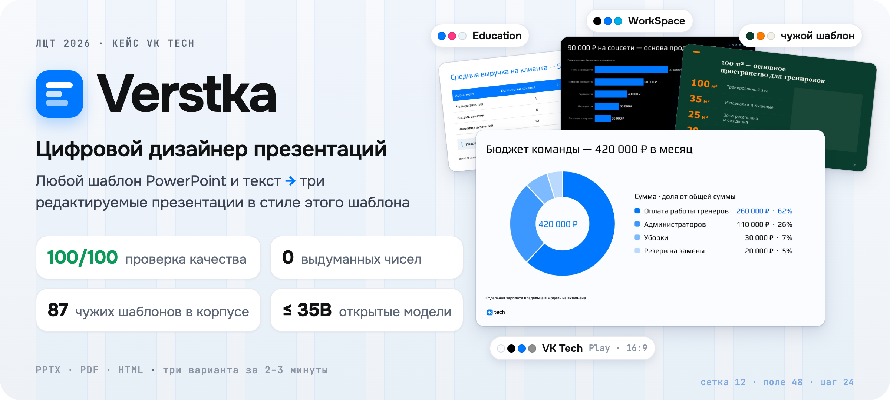
</p>

**Любой шаблон PowerPoint и текст на входе — три готовые редактируемые презентации в стиле этого шаблона на выходе, за две-три минуты.** Агент из открытых моделей решает, какие нужны слайды и как показать данные. Вёрстка собирает слайды по правилам самого шаблона. Проверка качества сверяет каждое число с исходным текстом, и каждое решение можно открыть и понять.

Кейс № 4 VK Tech «Цифровой дизайнер презентаций», хакатон «Лидеры цифровой трансформации 2026», команда «Рекрут 2».

[](https://github.com/hl0pch1k/verstka/actions/workflows/linux.yml)

## Для экспертов

| | Что посмотреть | Где |
|:-:|---|---|
| **1** | **Видео работы сервиса** · 9 мин 46 с, один дубль без монтажа и ускорения. Шаблон VK Tech из датасета и незнакомый шаблон SlidesCarnival: разбор шаблона, по три варианта на каждом, замечания проверки и их исправление агентом, правка слайда в чате, экспорт | [смотреть в браузере](https://cdn.jsdelivr.net/gh/hl0pch1k/verstka@3ec42ab/docs/video/verstka-demo.mp4) · [файл](docs/video/verstka-demo.mp4) · [что в видео](docs/video/README.md) |
| **2** | **Презентация проекта** · проблема, подход, архитектура пайплайна, демо, архитектура аудита, выводы | [PDF](docs/presentation/verstka-pitch.pdf) · [PPTX](docs/presentation/verstka-pitch.pptx) |
| **3** | **Готовые презентации** · 9 демо: один текст × три шаблона VK × три варианта; файлы прогонов из видео | [examples/outputs](examples/outputs) |
| **4** | **Запуск на своей машине** · пошагово: программы, установка, проверка без ключа за 10 секунд, ключ модели Cloud.ru, веб-интерфейс, тесты. Постоянного стенда у команды нет | [Запуск](#запуск) |
| **5** | **Соответствие ТЗ** по каждому пункту | [таблица](#соответствие-техническому-заданию) |
| **6** | **Документация** · слои и контракты, модели и настройки API, все проверки качества | [ARCHITECTURE](ARCHITECTURE.md) · [MODELS](MODELS.md) · [AUDIT](AUDIT.md) |

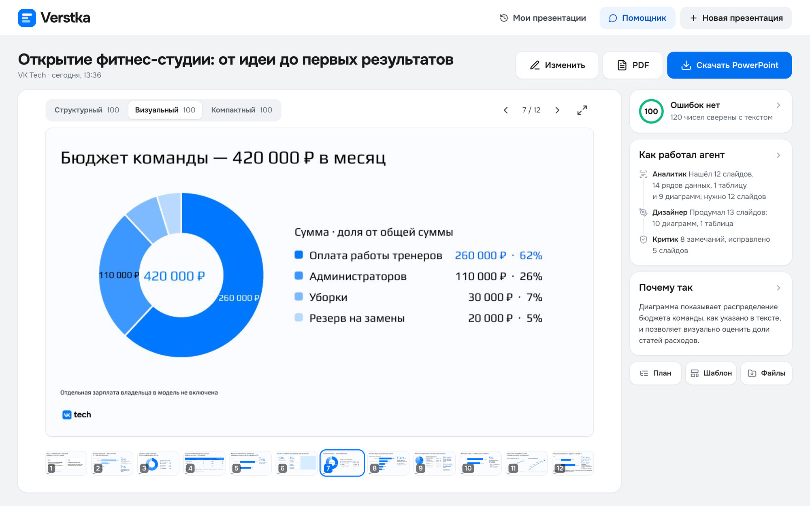

<sub>Настоящий прогон, без монтажа: бриф фитнес-студии на 12 слайдов ([examples/briefs/fitness_studio.md](examples/briefs/fitness_studio.md)), шаблон VK Tech, модель Qwen3-32B. Три варианта за 113 секунд, оценка проверки 100 из 100, 120 чисел на слайдах сверены с текстом.</sub>

[Как это выглядит](#как-это-выглядит) · [Что получается](#что-получается) · [Соответствие ТЗ](#соответствие-техническому-заданию) · [Как устроено](#как-устроено) · [Проверка качества](#проверка-качества) · [Модели](#модели) · [Запуск](#запуск)

## Коротко

- **Шаблон читается как набор правил.** Разбирается каждый слайд-образец, а не только макеты: палитра с ролями цветов, шкала кеглей, сетка и поля, хром (логотипы, колонтитулы), карточки, группы повторов, иконки и иллюстрации, правила оформления, написанные прямо на слайдах. Подходят шаблоны, нарисованные вручную на пустых слайдах без макетов.
- **Любой шаблон.** Принимаются 12 форматов: PowerPoint (`.pptx`, `.potx`, `.pptm`, `.potm`, `.ppsx`, `.ppsm`, `.ppt`, `.pot`, `.pps`), темы Office (`.thmx`) и OpenDocument (`.odp`, `.otp`). Регрессионный корпус из **87 чужих шаблонов** (Google Slides, SlidesCarnival, темы Office, LibreOffice, синтетические 4 : 3, 16 : 10 и 26,67″) — **261 колода со средней оценкой 99 из 100**.
- **Агент из открытых моделей ≤ 35B** (Qwen3.8-27B, Qwen3-32B, Qwen3-VL-30B; Apache 2.0). Аналитик читает бриф, дизайнер продумывает каждый слайд отдельно, критик проверяет план, компилятор сверяет цифры. Ход работы виден в интерфейсе в реальном времени.
- **Ни одного выдуманного числа.** Каждое число плана сверяется с брифом до вёрстки, готовый PPTX — ещё раз после неё: текст, таблицы, значения диаграмм. Производные (доли, суммы, рост, цена за единицу) помечаются отдельно.
- **Три варианта вёрстки** с разными осями: структурный, визуальный и компактный.
- **Проверка качества — часть пайплайна:** 41 детерминированная проверка (все 24 пункта Приложения 1 и ещё 17 сверх них) и 2 модельные (11 вопросов ТЗ по картинке слайда, связность колоды). Автоисправление с откатом, замечания прямо на слайде, исправление на выбор.
- **Чат с агентом.** «На слайде 5 покажи это крупными цифрами», «убери слайд 3», «почему слайд 4 такой», «верни как было».
- **PPTX с редактируемыми объектами** внутри пакета самого шаблона (мастера, макеты, тема, шрифты сохраняются), плюс PDF и HTML (текст — текстом, таблицы — `<table>`, диаграммы — SVG). Все 9 демо-колод проходят проверку схем OOXML.
- **Быстро и без зависимости от сети.** 12 слайдов в трёх вариантах: 2–3 минуты с моделью, 10–25 секунд без неё. Цепочка запасных моделей и полностью офлайн-режим.
- **2 035 автотестов:** 1 995 модульных и 40 интеграционных.

## Как это выглядит

### 1. Шаблон и текст

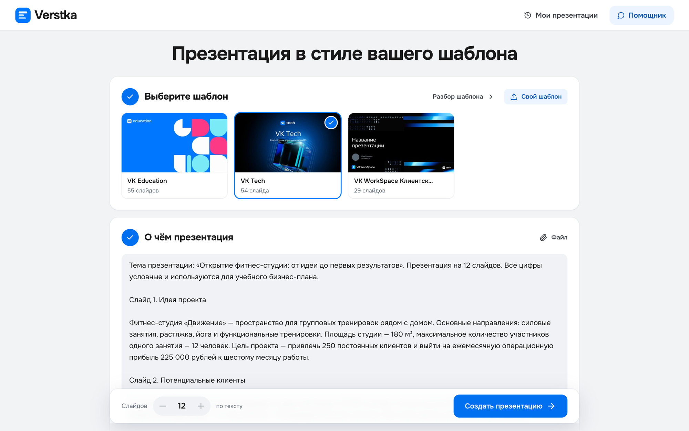

Выберите шаблон или загрузите свой: кнопка «Свой шаблон» или перетаскивание файла. Вставьте текст в свободной форме или по слайдам («Слайд 3. Расходы. Нужна круговая диаграмма…»). Число слайдов сервис берёт из текста и соблюдает ограничения вида «не более 8 слайдов». Разбор шаблона выполняется один раз и кэшируется по хэшу файла.

### 2. Агент работает на виду

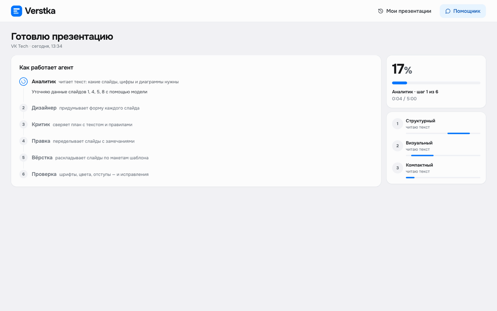

| Шаг | Что делает | Где в коде |
|---|---|---|
| Аналитик | Находит в тексте заказанные слайды, ряды данных, таблицы, просьбы («нужна круговая диаграмма», «оставь место под фото»), правила и оговорки | [`planning/brief_structure.py`](verstka/planning/brief_structure.py), скилл `data_extractor` |
| Дизайнер | Для каждого слайда отдельным вызовом модели выбирает форму по смыслу данных (таблица, диаграмма, крупные цифры, этапы, карточки), пишет заголовок-вывод, данные диаграммы, заметки докладчика и две альтернативы | [`planning/agent.py`](verstka/planning/agent.py), скилл `slide_designer` |
| Критик | Сверяет план с текстом и правилами: пропавшие данные, заголовок без вывода, повтор темы, нарушенная просьба | скилл `design_critic` |
| Правка | Дизайнер переделывает отмеченные слайды, лучшая версия остаётся | `merge_revision` в `agent.py` |
| Вёрстка | Раскладывает слайды по дизайн-системе шаблона | [`rendering/`](verstka/rendering) |
| Проверка | Аудит, автоисправление, сверка чисел, экспорт | [`audit/`](verstka/audit) |

Ход работы сохраняется: после сборки его можно открыть во вкладке «Агент».

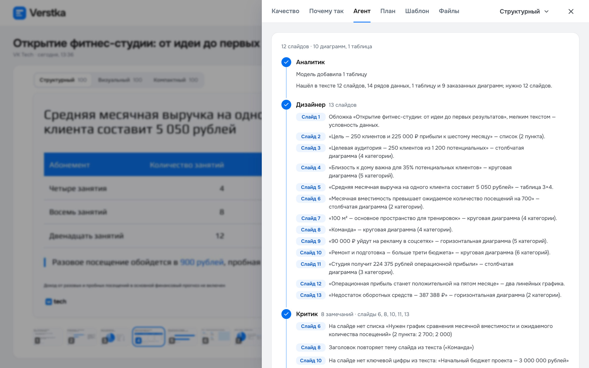

### 3. Три варианта

Одинаковое содержание, разная подача. Ось различий выбрана так, чтобы варианты отвечали разным задачам показа ([`configs/strategies.yaml`](configs/strategies.yaml)):

- **Структурный.** Одна мысль на слайд, диаграмма и пункты рядом, точные таблицы.
- **Визуальный.** Крупные цифры-выноски вместо пунктов, кольцевые диаграммы с итогом в центре, фирменная графика шаблона.
- **Компактный.** Вывод первой строкой, текст слева, данные справа, сравнения таблицами.

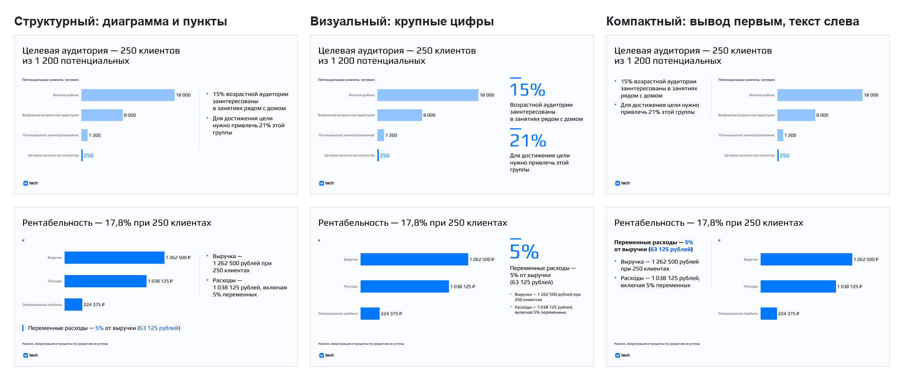

### 4. Каждое решение объяснено

Вкладка «Почему так»: почему выбрана эта форма, какие ещё формы подходили, из чего собран слайд. Решение о макете объяснимо: каждый образец шаблона получает балл, и причины записаны в `layout_plan.json`.

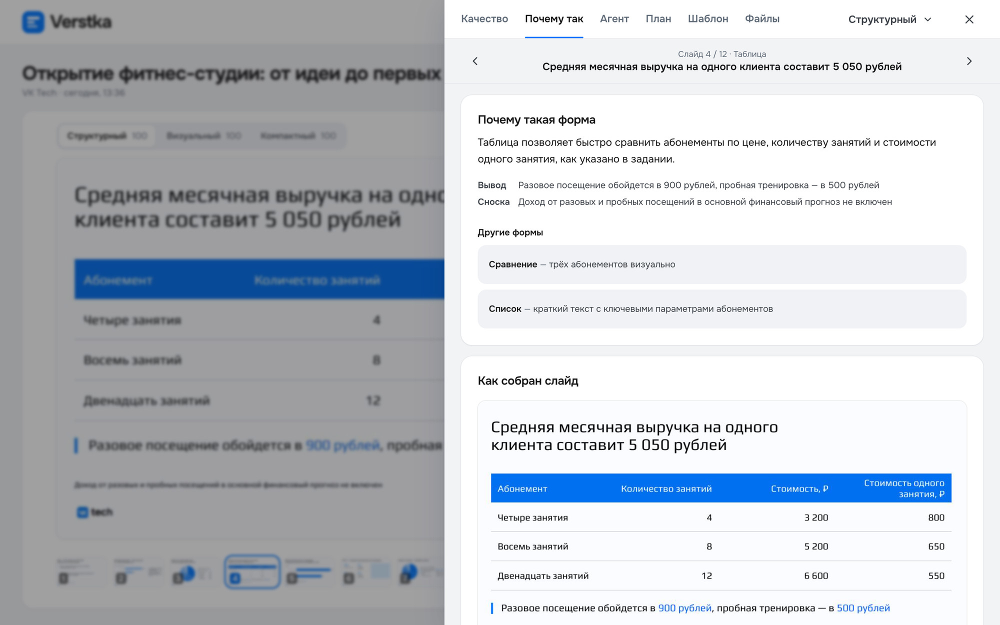

### 5. Проверка качества

Замечания видны прямо на слайде. «Исправить слайд» отдаёт слайд дизайнеру вместе с замечаниями и вашими пожеланиями, остальные слайды не меняются. Замечания, у которых есть автоисправление, применяются все сразу или на выбор.

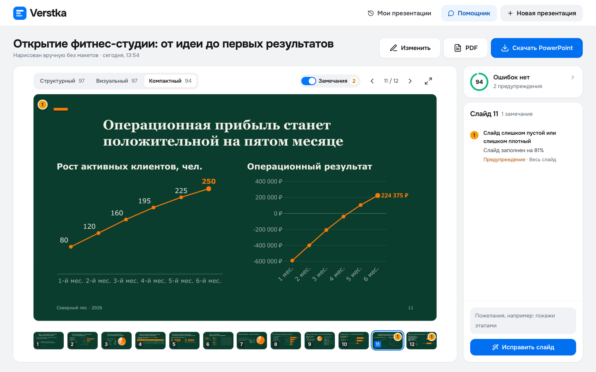

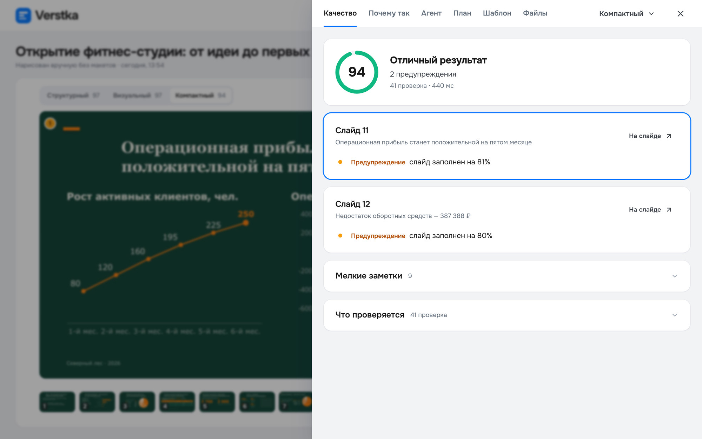

### 6. Чат с агентом

Правка словами — та же работа дизайнера с той же сверкой чисел. Каждая правка сохраняет прежнюю версию, «верни как было» откатывает её точно.

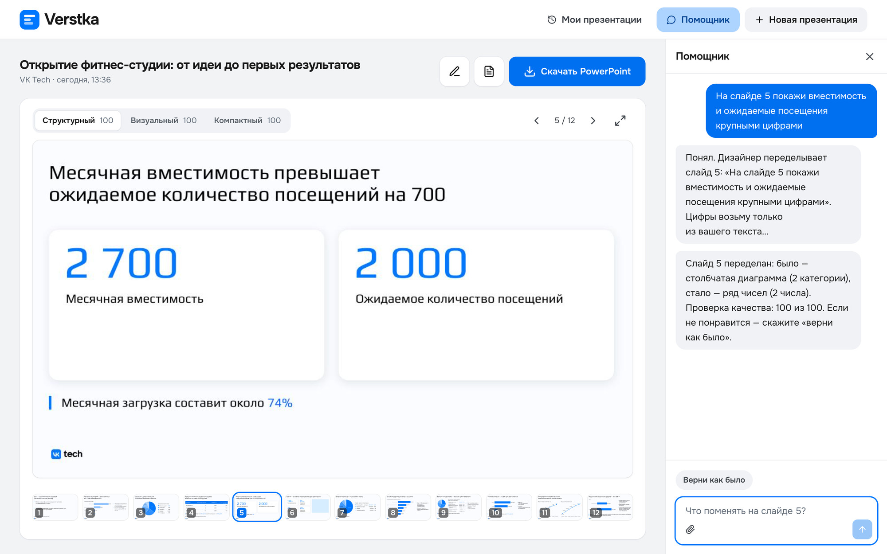

<sub>Было: столбчатая диаграмма «Месячная вместимость / Ожидаемые посещения». Просьба в чате — и через 20 секунд на слайде две цифры с подписями, вывод сохранён, проверка 100 из 100.</sub>

### 7. Что сервис понял из шаблона

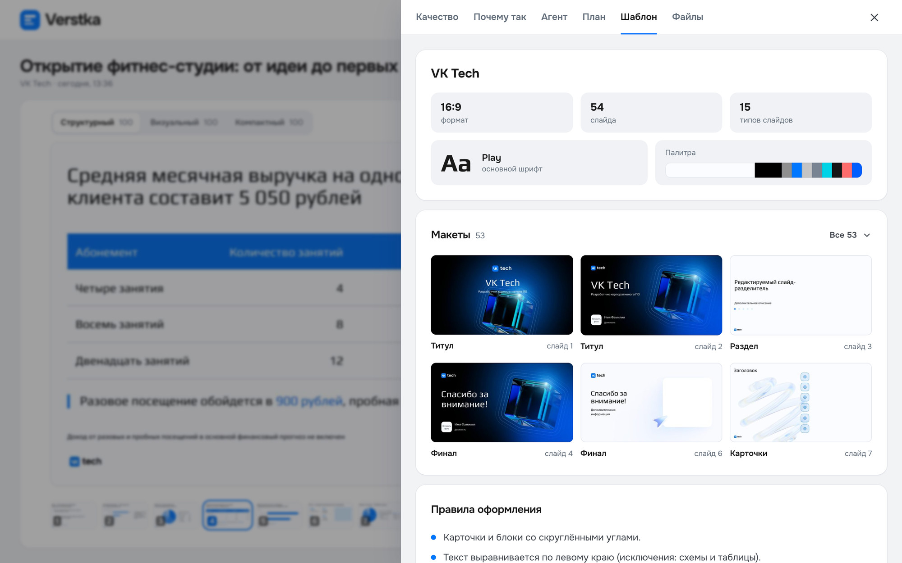

Формат и размер слайда, шрифты и шкала кеглей, палитра с ролями цветов, все макеты с типами (голосуют эвристики, текстовая модель и модель, которая смотрит на картинку слайда), правила оформления. Тот же разбор лежит в `workspace/templates/<id>/manifest.json` и в наглядном `gallery.html`.

## Что получается

### Один текст, три шаблона VK, три варианта: 9 презентаций

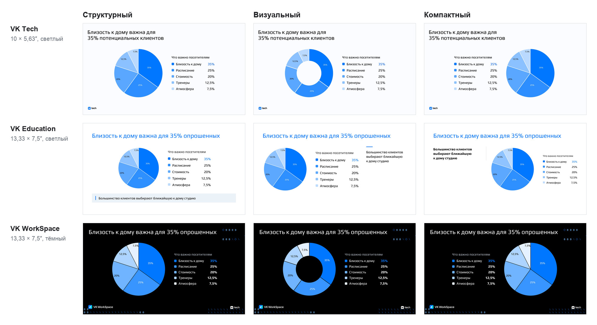

| Шаблон | Слайдов | Время, 3 варианта | Проверка качества | Числа сверены с текстом |
|---|---|---|---|---|
| VK Tech | 12 | 113 с | 100 / 100 / 100 | 116–120, лишних нет |
| VK Education | 12 | 145 с | 100 / 100 / 100 | 119–123, лишних нет |
| VK WorkSpace | 12 | 175 с | 100 / 100 / 100 | 118–122, лишних нет |

Время — от нажатия «Создать презентацию» до готового результата; чистое время пайплайна — поле `seconds` в [`summary.json`](examples/outputs/summary.json).

Все файлы — в [`examples/outputs/`](examples/outputs): для каждого шаблона и варианта `deck.pptx`, `deck.pdf`, `deck.html`, план `outline.json`, решения по макетам `layout_plan.json`, отчёт проверки `audit_report.json`, паспорт запуска `run_manifest.json` и ответы модели `planner_raw.json`. Сводка — [`summary.json`](examples/outputs/summary.json). Повторить: `python scripts/make_demo_decks.py`.

<details>
<summary><b>Колоды целиком</b></summary>

VK Tech, визуальный вариант:

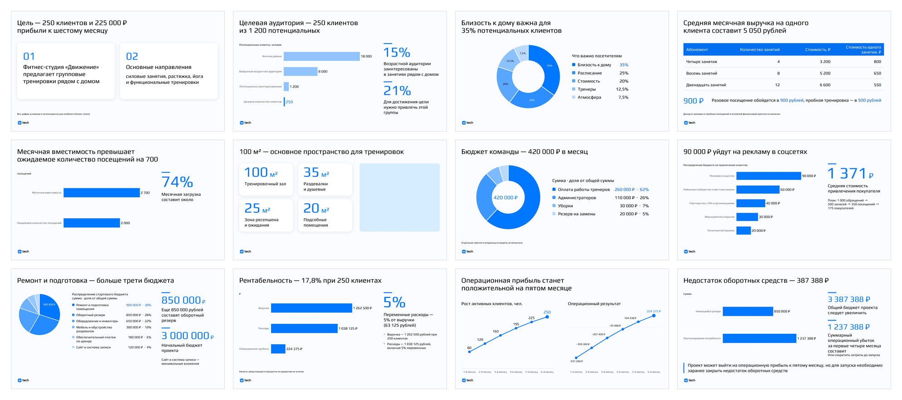

VK Education, структурный вариант:

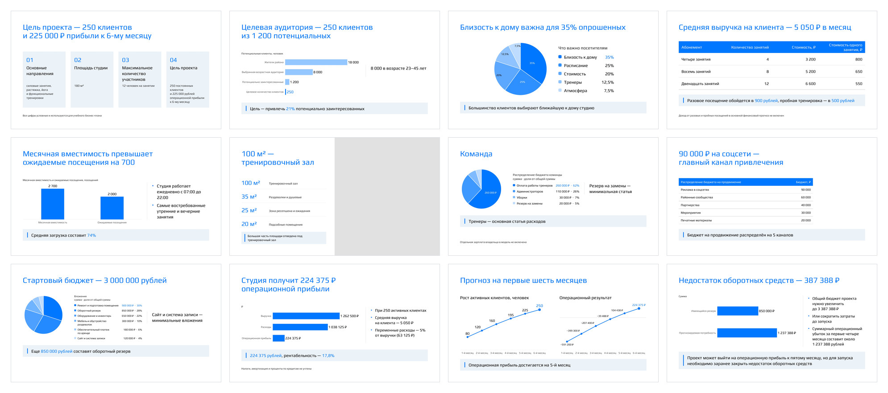

VK WorkSpace, компактный вариант:

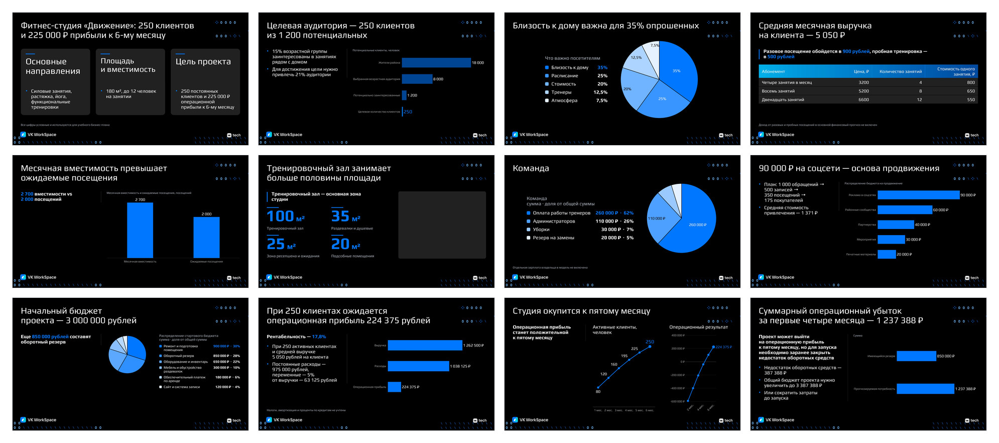

</details>

### Данные на слайдах

Форму выбирает дизайнер по смыслу данных. Все объекты — родные для PowerPoint: диаграммы редактируются вместе с данными, таблицы — обычные таблицы. Типы диаграмм: столбцы, полосы, линии, области, круговая, кольцевая; две диаграммы на одном слайде; крупные цифры с подписями, этапы и процессы, карточки из фигур самого шаблона.

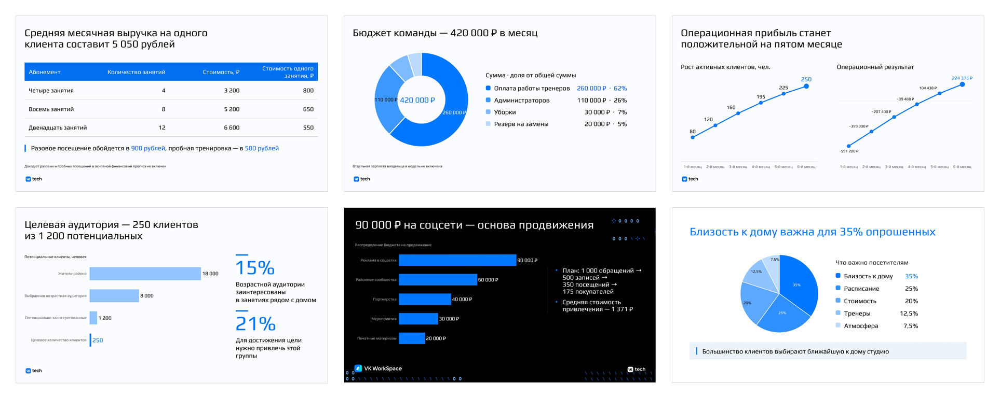

### Чужие шаблоны

На финале сервис прогонят на шаблоне, которого он не видел. Поэтому ничего не завязано на три шаблона датасета: хром находится по повторам и по рендерам слайдов, пустые рамки становятся местами для текста, справочные слайды (листы иконок, палитры) не идут в макеты, цвет текста выбирается по реальному фону под ним, шрифтам без кириллицы подбирается замена того же класса.

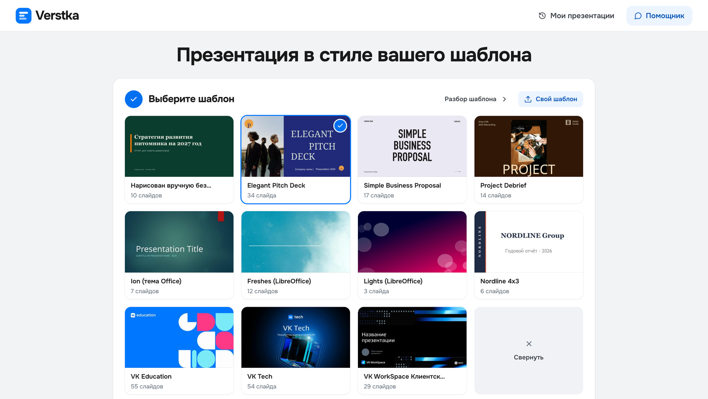

Тот же план из 12 слайдов, свёрстанный в чужих шаблонах: таблица абонементов, слайд с местом под фото, два линейных графика.

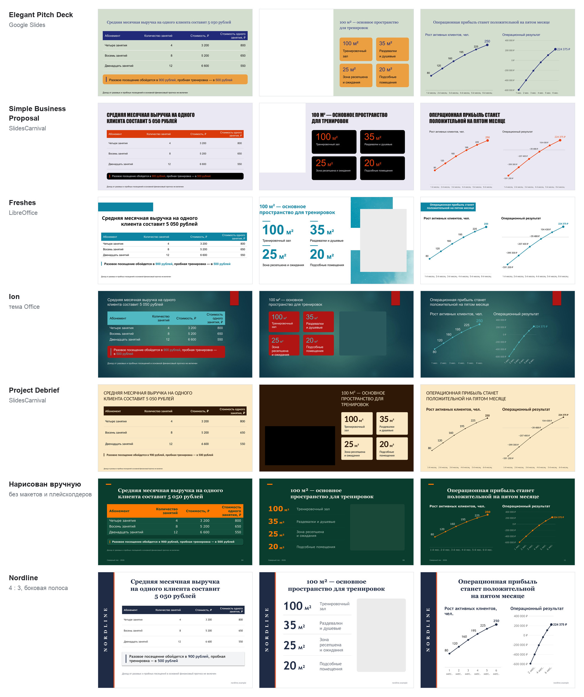

Прогон из видео — «Dark Minimalist Business» с SlidesCarnival, которого нет ни в датасете, ни в корпусе: три варианта за 1 мин 27 с, оценки 100 · 100 · 100, файлы — [`examples/outputs/video/`](examples/outputs/video).

Проверка на корпусе: **87 шаблонов, 261 колода, средняя оценка 99**. Каждую правку движка прогоняют на всём корпусе, а колоды шаблонов VK сравниваются с эталоном фигура за фигурой ([`tests/integration/test_unseen_templates.py`](tests/integration/test_unseen_templates.py) — невиданный шаблон ЛЦТ и колода, нарисованная вручную без макетов).

### Место под собственное фото

«На этом слайде оставь свободное место под фотографию помещения, фото я добавлю сам» — это просьба, а не текст слайда. Если в шаблоне есть слайд с фотографией, сервис берёт его и превращает фото образца в пустую рамку (в PowerPoint фото вставляется в неё одним кликом). Если такого слайда нет, рядом с контентом ставится спокойная рамка.

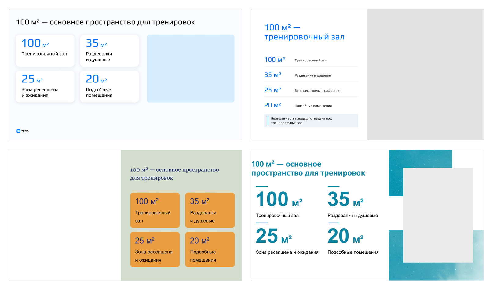

## Соответствие техническому заданию

✅ — сделано, ◐ — частично, ⏳ — по регламенту на этапе доработки.

**Бизнес-задачи и функциональность (раздел 2 ТЗ)**

| Требование | | Как сделано | Сверх ТЗ |
|---|---|---|---|
| Парсинг шаблона для воспроизводимости | ✅ | [`verstka/analysis/`](verstka/analysis) → `manifest.json`: токены, паттерны, компоненты, ассеты, правила; кэш по хэшу файла | Единица анализа — слайд-образец: в реальных шаблонах 95 % фигур свободные, не плейсхолдеры |
| Структура и текст по краткому брифу и назначению (фича, продукт, проект, инициатива) | ✅ | Агент [`planning/agent.py`](verstka/planning/agent.py): состав, порядок и содержание слайдов готовы до вёрстки (`outline.json`); назначение — «Тип презентации» в настройках | Детерминированный планировщик без модели; «не более N слайдов» соблюдается всегда |
| Слайды по шаблону с контекстной визуализацией | ✅ | [`rendering/compose.py`](verstka/rendering/compose.py): форма по назначению данных, дизайн-система шаблона | Место под собственное фото, выводы-плашки, сноски-оговорки |
| 1. Импорт и декомпозиция шаблонов и контент-пакетов | ✅ | [`ingest/convert.py`](verstka/ingest/convert.py): 12 форматов; контент-пакет (по разъяснению организаторов — сами шаблоны) даёт библиотеку иконок, иллюстраций и фонов | Шаблон без слайдов (`.potx`) получает образцы из собственных макетов |
| 2. Генерация слайдов в контексте шаблона и контент-пакета | ✅ | Холст — самый чистый слайд-образец той же семьи; карточки — копии фигур шаблона; обложки и финал — клоны образцов | — |
| 3. Графики, таблицы, диаграммы, пиктограммы, SmartArt внутри слайда | ✅ | Нативные диаграммы 6 типов и пары диаграмм, таблицы, крупные цифры, этапы и процессы из фигур (аналог SmartArt), иконки и иллюстрации из библиотеки шаблона | Цвета диаграмм подбираются по фону под ними; легенда повторяет цвета секторов точно |
| 3.1. Генерация изображений (задача со звёздочкой, для топ-10) | ⏳ | Модели выбраны и описаны в [`MODELS.md`](MODELS.md): Z-Image-Turbo 6B, Qwen-Image 20B, Apache 2.0 | — |
| 4. Версионирование скиллов и агентов | ✅ | [`skills/<имя>/skill.yaml`](skills) с версией и sha256, промпты отдельными файлами, [`agents/*.yaml`](agents); версии и хэши каждого запуска — в `run_manifest.json` | Сравнение двух запусков: чем отличаются план, макеты, версии скиллов (`/diff`) |
| 5. Три варианта вёрстки с обоснованной осью различий | ✅ | [`configs/strategies.yaml`](configs/strategies.yaml): структурный, визуальный, компактный — см. [«Три варианта»](#3-три-варианта) | — |
| 6. Аудит с визуализацией и выбором исправлений; часть пайплайна | ✅ | [`audit/`](verstka/audit): 41 + 2 проверки, автоисправление до 2 итераций с откатом ухудшения; замечания на слайде; исправление на выбор, «Исправить слайд» с пожеланием | Сверка каждого числа с текстом; проверка, что слайд из плана не пропал из колоды |
| 7. Экспорт .html, .pptx, .pdf; в PPTX — нативные объекты | ✅ | [`export/`](verstka/export): PPTX внутри пакета шаблона, PDF через LibreOffice, HTML собственным рендерером (текст, `<table>`, SVG) | Проверка схем OOXML: все 9 демо-колод проходят |

**Рамки решения**

| Требование | | Как сделано |
|---|---|---|
| Декомпозировать три шаблона разных типов | ✅ | VK Tech (10 × 5,63″, светлый, 54 слайда), VK Education (13,33 × 7,5″, светлый, 55), VK WorkSpace (13,33 × 7,5″, тёмный, 29) — и ещё 87 шаблонов корпуса |
| Выделить токены, композиционные паттерны, типографику, визуальные элементы | ✅ | Вкладка «Шаблон», `manifest.json`, `gallery.html` |
| Встроить визуализацию с учётом правил композиции и ограничений макета | ✅ | Диаграммы и таблицы занимают свободную область холста, обходят рисунок шаблона, текст не заходит под логотипы |
| Пайплайн генерации и аудита | ✅ | [Как устроено](#как-устроено) |
| 10–15 слайдов или заданное пользователем число | ✅ | Число из текста и из поля «Слайдов»; «не более N слайдов» обязательно |
| Не более 5 минут на колоду | ✅ | 113–175 с на три варианта по 12 слайдов с моделью, 10–25 с без модели |
| Не заточено под три шаблона | ✅ | Корпус из 87 шаблонов, нарисованные вручную колоды, 4 : 3 и нестандартные размеры |

**Программно-аппаратные требования**

| Требование | | Как сделано |
|---|---|---|
| Десктопный веб | ✅ | Интерфейс для экранов от 1280 px |
| Chrome, Firefox, Safari, Яндекс Браузер | ◐ | Проверено в Chrome. Только стандартные веб-API; анимации переходов (View Transitions) выключаются там, где их нет |
| Открытые веса, Apache 2.0 / MIT, ≤ 35B | ✅ | Qwen3.8-27B, Qwen3-32B, Qwen3-VL-30B-A3B, Gemma 4 — [`MODELS.md`](MODELS.md). Закрытые API не используются нигде, тесты работают на `MockProvider` |
| Инференс VK для топ-10 | ✅ | Готовый конфиг [`configs/models.vk.yaml`](configs/models.vk.yaml): меняются только адрес и ключ |
| Python / TypeScript, React | ✅ | Python 3.11 + FastAPI, React 18 + TypeScript + Vite |

**Документация и сдача**

| Требование | | Где |
|---|---|---|
| README: сетап, переменные окружения, ограничения | ✅ | [Запуск](#запуск), [Ограничения](#ограничения) |
| ARCHITECTURE: пайплайн, границы слоёв | ✅ | [`ARCHITECTURE.md`](ARCHITECTURE.md) |
| MODELS: модели, применение, требования, ссылки на Hugging Face | ✅ | [`MODELS.md`](MODELS.md) |
| AUDIT: список проверок и тестов, покрытие | ✅ | [`AUDIT.md`](AUDIT.md) |
| Промпты и конфиги отдельными файлами | ✅ | [`skills/`](skills), [`agents/`](agents), [`configs/`](configs) |
| Открытый репозиторий, демонстрация end-to-end на неизвестном шаблоне | ✅ | [Чужие шаблоны](#чужие-шаблоны) |
| 9 презентаций: три варианта на одном контенте в трёх шаблонах | ✅ | [`examples/outputs/`](examples/outputs) |
| Воспроизводимый сетап и запуск конфиг-файлом | ✅ | `verstka generate --config configs/run.example.yaml` |
| Видео-демо: запись экрана без монтажных склеек | ✅ | [`docs/video/verstka-demo.mp4`](docs/video/verstka-demo.mp4): один дубль без ускорения — шаблон VK Tech и шаблон, которого нет в датасете; файлы прогонов — [`examples/outputs/video/`](examples/outputs/video) |
| Питч: проблема, подход, архитектура пайплайна, демо, архитектура аудита, выводы | ✅ | [`docs/presentation/verstka-pitch.pdf`](docs/presentation/verstka-pitch.pdf), редактируемый PPTX рядом |

**Пожелания экспертов на встрече с командами**

| Пожелание | Как сделано |
|---|---|
| Читать чужой шаблон как набор правил, образцами считать обычные слайды | Разбор по слайдам-образцам; макеты и мастера — источник хрома и стилей |
| Шаблон может быть нарисован вручную, без макетов | Колода без плейсхолдеров в интеграционных тестах и в корпусе |
| Шрифты и цвета — только из шаблона | Проверки `font_not_in_template` и `color_not_in_palette`; замена шрифта без кириллицы — того же класса и, если есть, из самого шаблона |
| Показывать данные красиво | Форма по смыслу данных, выноски с крупными цифрами, итог в центре кольца |
| Основной формат — чат с агентом | Помощник понимает правки, вопросы «почему», проверку и исправление |
| Прослеживаемость: какой скилл какой версии сделал результат | `run_manifest.json`, вкладка «Файлы» → паспорт запуска, сравнение запусков |
| Два пути: шаблон + текст → колода и готовая колода → улучшенная | Первый — основной сценарий; для второго `verstka audit` проверяет любую готовую колоду по правилам шаблона |

## Как устроено

<p align="center">
  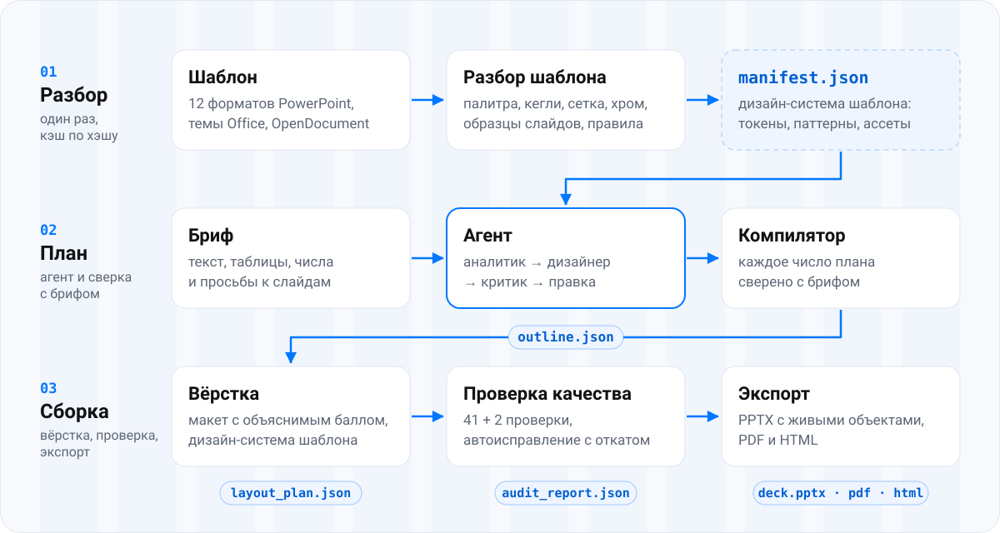
</p>

Замечания проверки и просьбы из чата возвращаются к агенту: он переделывает только нужный слайд, а сверка чисел и проверка проходят заново.

| Слой | Модуль | Вход → выход | Ключевые решения |
|---|---|---|---|
| Приём файла | [`ingest/`](verstka/ingest) | любой файл → `.pptx` | Тип определяется по содержимому; макросы удаляются; старые форматы переводит LibreOffice; шаблону без слайдов собираются образцы из его макетов |
| Разбор шаблона | [`analysis/`](verstka/analysis) | `.pptx` → `manifest.json` | Палитра с ролями, шкала кеглей, сетка и поля; хром по повторам и по рендерам (логотипы, «зашитые» в фон); группы повторов «карточки × N»; тип слайда голосованием эвристик, LLM и VLM |
| Планирование | [`planning/`](verstka/planning) | бриф + манифест → `outline.json` | Реестр фактов: каждое число с цитатой; дизайнер на каждый слайд; критик и одна правка; сверка с брифом ([`grounding.py`](verstka/planning/grounding.py)) отбрасывает выдуманные числа |
| Подбор макета | [`matching/`](verstka/matching) | план + манифест → `layout_plan.json` | Балл каждого образца с причинами и альтернативами |
| Вёрстка | [`rendering/`](verstka/rendering) | план → `deck.pptx` | Контентные слайды компонуются по дизайн-системе шаблона ([`compose.py`](verstka/rendering/compose.py)), обложки и финал — клоны образцов; текст подбирается по метрикам шрифта; фон под каждым текстом измеряется, цвет берётся из палитры |
| Проверка качества | [`audit/`](verstka/audit) | `deck.pptx` → `audit_report.json` | Промежуточное представление колоды со слоями шаблона; реестр проверок; автоисправление с откатом |
| Экспорт | [`export/`](verstka/export) | `deck.pptx` → PDF, HTML | Один запуск LibreOffice на колоду, варианты параллельно |
| Сервис и интерфейс | [`api/`](verstka/api), [`web/`](web) | — | FastAPI с задачами и SSE, React; чат-агент |

Подробно, со всеми правилами для чужих шаблонов: [`ARCHITECTURE.md`](ARCHITECTURE.md).

**Воспроизводимость.** Любая правка промпта меняет sha256 скилла. Версии и хэши скиллов, модели, конфиг и git-коммит попадают в `run_manifest.json` каждой генерации. Ответ модели валидируется по JSON-схеме с повторами. Если модель недоступна, шаг заменяется детерминированным запасным вариантом, и это тоже записывается.

Паспорт каждого запуска виден в интерфейсе (вкладка «Файлы»): кто составил план и какой моделью, время по этапам, итог проверки, версии всех скиллов и агентов — и совпадают ли они с текущими.

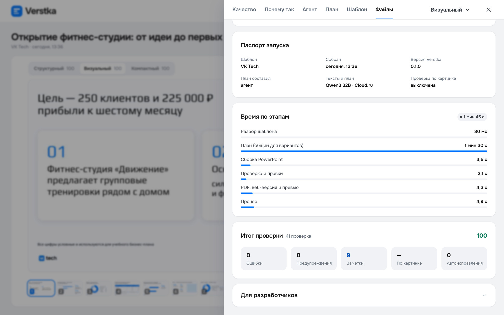

<details>
<summary><b>Версии скиллов в паспорте запуска</b></summary>

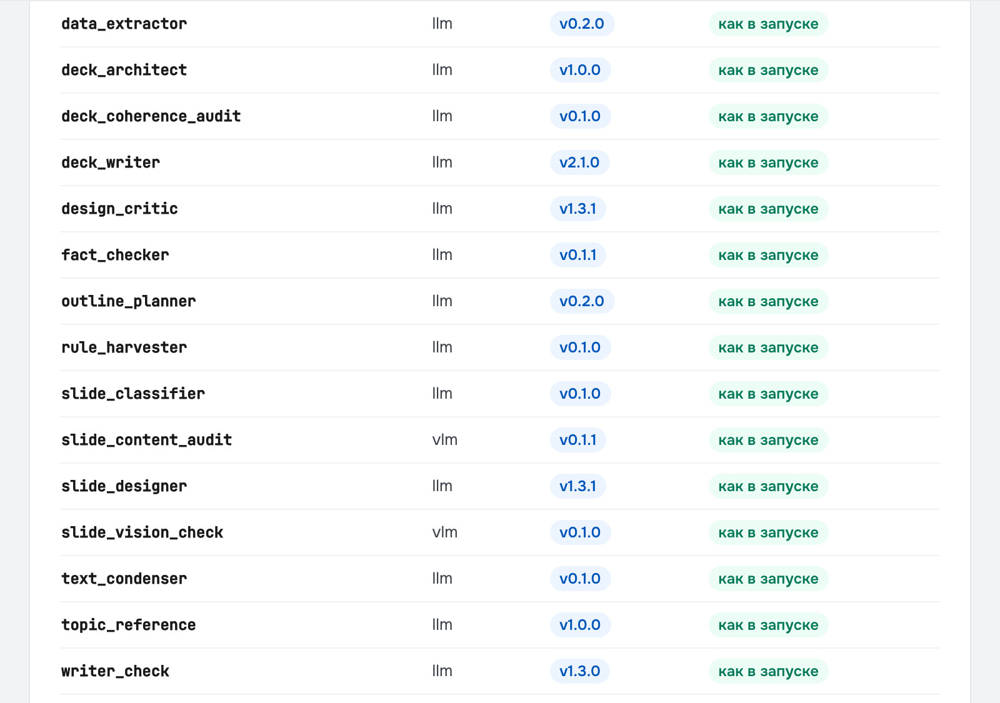

</details>

```
skills/<имя>/skill.yaml       версия, роль модели (llm | vlm), параметры, схема ответа
skills/<имя>/prompts/*.md     промпты (Jinja2) отдельными файлами
agents/*.yaml                 какие скиллы и в каком порядке использует агент
configs/*.yaml                модели, стратегии, пороги анализа
```

## Проверка качества

| Категория | Проверок | Примеры |
|---|---|---|
| Вёрстка | 11 | выход за край, наложение блоков, переполнение рамки, текст за карточкой, поля, сетка, растянутая картинка, разрыв слова, контент поверх рисунка шаблона |
| Шаблон | 7 | шрифт не из шаблона и больше двух гарнитур, кегль не из шкалы, цвет не из палитры, слайд не на макете шаблона, сдвинутый хром, контраст ниже 4,5 : 1 (на фоне под текстом), контраст в таблицах |
| Плотность | 5 | больше 6 пунктов, пункт длиннее 15 слов, таблица больше 10 строк или 5 колонок (по разъяснению организаторов вместо 7 строк), больше 5 рядов на диаграмме, заполнение меньше 25 % или больше 80 % |
| Целостность | 12 | файл не открывается, заглушки, пустой слайд, слайд-картинка, пропавший контент, пропавший слайд, диаграмма без подписей, дубли, вывод только в заметках, хронология |
| Контент | 6 | число не из текста, обрывок фразы, время суток вместо величины, повтор заголовка, разные единицы в одном ряду, отсылка без предмета |
| Модельные | 2 | 11 вопросов Приложения 1 по картинке слайда (VLM), связность и язык колоды (LLM) |

Все пункты Приложения 1 закрыты, и каждая проверка ищет проблему там, где её увидит человек: контраст считается по реальному фону под текстом с учётом прозрачности, градиентов и картинок, а переполнение — по метрикам шрифта. Полный список с правилами и действиями автоисправления: [`AUDIT.md`](AUDIT.md) (генерируется из реестра), `verstka checks`.

## Модели

| Роль | Модель | Лицензия | Размер |
|---|---|---|---|
| текст и план | Qwen3.8-27B — та же модель, что даёт инференс VK | Apache 2.0 | 27B |
| текст и план, запасная | Qwen3-32B (Cloud.ru) | Apache 2.0 | 32,8B |
| картинки слайдов | Qwen3-VL-30B-A3B (Cloud.ru) | Apache 2.0 | 31B MoE, 3B активных |
| запасные бесплатные | Gemma 4 31B, Gemma 4 26B-A4B | Apache 2.0 | ≤ 31B |

Модели выстроены в цепочку: если звено не отвечает (перегрузка, нет денег на счёте, лимит), запрос сразу уходит следующему, а состояние каждого звена видно в интерфейсе. Для финала — одна модель на инференсе VK ([`configs/models.vk.yaml`](configs/models.vk.yaml)). Подробности, цены и где какая модель используется: [`MODELS.md`](MODELS.md).

## Структура репозитория

```
verstka/
  ingest/        приём файлов любых форматов, рендер превью
  analysis/      разбор шаблона: токены, паттерны, роли, хром, ассеты, правила
  planning/      агент, аналитик брифа, сверка с брифом, компилятор, правки слайдов
  matching/      подбор макета с объяснением
  rendering/     компоновка по дизайн-системе, клонирование, диаграммы, таблицы, шрифты
  audit/         промежуточное представление колоды, проверки, автоисправление
  export/        PDF и HTML
  api/           FastAPI: задачи, генерации, чат, правки
  providers/     OpenAI-совместимые провайдеры и цепочка моделей
skills/          16 скиллов: промпты и параметры отдельными файлами, версии
agents/          4 агента: какие скиллы и в каком порядке
configs/         модели, стратегии, пороги, пример конфига запуска
web/             интерфейс: React + TypeScript
examples/        брифы и 9 демо-презентаций
tests/           1 995 модульных и 40 интеграционных тестов
docs/            видео работы сервиса, презентация проекта, иллюстрации README
```

## Ограничения

- Интерфейс рассчитан на десктоп; мобильная вёрстка не делалась.
- Превью и PDF рисует LibreOffice: шрифт шаблона, которого нет в системе, заменяется. В самом PPTX шрифты шаблона сохраняются, а для русского текста шрифт без кириллицы заменяется близким по классу.
- Ширина текста считается по метрикам встроенных шрифтов и поправочным коэффициентам для остальных, поэтому подгонка текста консервативна.
- Без модели планировщик опирается на структуру брифа (разделы, перечисления, числа, таблицы Markdown); свободный текст без структуры лучше планирует модель.
- SmartArt, видео и анимации шаблона не разбираются, слайды с ними не используются как образцы.
- Генерация изображений (задача со звёздочкой) запланирована на этап доработки; сейчас в колоду попадают только иконки и иллюстрации самого шаблона.
- Хранилище файловое, очередь задач — в процессе: сервис рассчитан на одного или нескольких пользователей, а не на продакшен-нагрузку.
- Сервис разрабатывался на macOS. На Linux установка, генерация без ключа, веб-сервис и модульные тесты проверяются в GitHub Actions на Ubuntu 24.04 ([`linux.yml`](.github/workflows/linux.yml)); для Linux есть отдельная настройка шрифтов LibreOffice. На Windows запускайте сервис в WSL 2.
- Постоянного стенда нет: у команды нет подходящего сервера для постоянной работы сервиса. Сервис запускается на любой машине по разделу [«Запуск»](#запуск), его работа показана в [видео](docs/video/README.md).

## Документы

- [`ARCHITECTURE.md`](ARCHITECTURE.md) — слои, контракты, правила для чужих шаблонов
- [`MODELS.md`](MODELS.md) — модели, лицензии, цепочка, стоимость, локальный запуск
- [`AUDIT.md`](AUDIT.md) — все проверки, автоисправление, покрытие тестами
- [`docs/video/`](docs/video) — видео работы сервиса и что в нём показано, [`docs/presentation/`](docs/presentation) — презентация проекта
- [`docs/DEMO_SCRIPT.md`](docs/DEMO_SCRIPT.md) — сценарий демо-видео

Лицензия: MIT, см. [`LICENSE`](LICENSE). Шрифт Play в `verstka/fonts/` — SIL OFL 1.1 ([`OFL.txt`](verstka/fonts/OFL.txt)).

## Запуск

Verstka — самостоятельный сервис: веб-интерфейс и API работают в одном процессе `verstka serve` на вашей машине, открытые модели подключаются по API. GPU не нужен.

> **Постоянного сервера у команды нет.** Поэтому у прототипа нет публичного адреса. Сервис запускается на любой машине по инструкции ниже, на чистой машине это около 15 минут. Работа сервиса целиком показана в [видео](docs/video/README.md). Установка, проверка без ключа, веб-сервис и модульные тесты по этой инструкции проверяются при каждом изменении кода на Ubuntu 24.04 в GitHub Actions ([`linux.yml`](.github/workflows/linux.yml)).

Ниже семь шагов. Команды — для Linux (Ubuntu 24.04) и macOS. На Windows установите WSL 2 с Ubuntu и выполняйте команды для Ubuntu внутри неё.

### Шаг 1. Системные программы

| Программа | Зачем |
|---|---|
| Python 3.11 или 3.12 | сам сервис |
| LibreOffice | картинки слайдов, PDF, превью шаблонов |
| poppler (`pdftoppm`) | картинки слайдов из PDF |
| Node.js 20 или новее | один раз собрать веб-интерфейс |
| git | скачать код |

**Ubuntu 24.04:**

```bash
sudo apt-get update
sudo apt-get install -y git python3-venv python3-pip libreoffice-impress poppler-utils
```

Из стандартного репозитория Ubuntu 24.04 ставится Node.js 18, а сборка интерфейса проверяется на 20. Поставьте Node.js 20 из репозитория NodeSource:

```bash
curl -fsSL https://deb.nodesource.com/setup_20.x | sudo -E bash -
sudo apt-get install -y nodejs
```

**macOS** (через [Homebrew](https://brew.sh)):

```bash
brew install python@3.11 node poppler git
brew install --cask libreoffice
```

Проверьте, что всё на месте: каждая команда должна напечатать версию.

```bash
python3 --version     # 3.11.x или 3.12.x (на macOS: python3.11 --version)
node --version        # v20 или новее
soffice --version     # LibreOffice; на macOS: /Applications/LibreOffice.app/Contents/MacOS/soffice --version
pdftoppm -v
```

### Шаг 2. Код и зависимости

```bash
git clone https://github.com/hl0pch1k/verstka.git
cd verstka
python3 -m venv .venv            # на macOS: python3.11 -m venv .venv
source .venv/bin/activate
pip install --upgrade pip
pip install -e ".[api,dev]"
cd web && npm install && npm run build && cd ..
```

`source .venv/bin/activate` включает окружение сервиса. В каждом новом окне терминала его нужно включать снова, находясь в папке `verstka`.

**Только на macOS:** LibreOffice для macOS видит лишь установленные шрифты. Установите шрифт Play из репозитория, иначе превью шаблонов VK нарисуются запасным шрифтом. В Linux он подключается сам, в PPTX шрифты шаблона сохраняются в любом случае.

```bash
cp verstka/fonts/Play-*.ttf ~/Library/Fonts/
```

### Шаг 3. Проверка без ключа и без сети — около 10 секунд

```bash
verstka generate -t tests/fixtures/tpl_audit/templates/lo_focus.pptx -b examples/briefs/fitness_studio.md -o out/check --no-llm --no-vlm
```

Шаблон лежит в репозитории, модель не нужна. В консоли появятся план слайдов и оценка проверки качества каждого варианта. В папке `out/check/` будут три варианта (`structured`, `visual`, `compact`), в каждом `deck.pptx` и отчёты. Если так и есть, установка прошла успешно.

Без ключа сервис работает полностью, только в офлайн-режиме: детерминированный разбор шаблона, планировщик по структуре текста и детерминированная проверка качества. С моделью формулировки живее, а сложные тексты раскладываются по слайдам точнее.

### Шаг 4. Ключ модели

Модели не запускаются на вашей машине: сервис обращается к открытым моделям по OpenAI-совместимому API. Для демо-прогонов (видео и 9 демо-презентаций) команда брала ключ **Cloud.ru Foundation Models**: там работает Qwen3-32B (Apache 2.0), оплата российской картой, одна генерация трёх вариантов стоит около 3 ₽.

**Как получить ключ Cloud.ru** (по [быстрому старту Foundation Models](https://cloud.ru/docs/foundation-models/ug/topics/quickstart)):

1. Зарегистрируйтесь на [cloud.ru](https://cloud.ru) и войдите в личный кабинет. Пополните баланс: запросы к моделям платные.
2. Откройте меню (значок из девяти точек) → «Пользователи» → вкладка «Сервисные аккаунты» → «Создать аккаунт». Задайте название, уровень «Проект», нажмите «Продолжить» и «Создать».
3. Откройте созданный аккаунт. В разделе «Учетные данные доступа» нажмите «Создать API-ключ». В поле «Сервисы» выберите «Foundation Models», срок действия — например, 90 дней. Нажмите «Создать».
4. Сразу скопируйте **Key Secret**: после закрытия окна его больше не покажут.

**Куда вписать ключ.** Создайте файл `.env` из примера:

```bash
cp .env.example .env
```

Откройте `.env` в любом текстовом редакторе (например, `nano .env`). Найдите строку `# CLOUDRU_API_KEY=`, уберите `#` в начале и вставьте ключ после знака `=`:

```
CLOUDRU_API_KEY=ваш_Key_Secret
```

Сохраните файл. `.env` не попадает в git, ключ остаётся только на вашей машине. Сервис читает `.env` при запуске, поэтому после изменения ключа перезапустите `verstka serve`.

С одним ключом Cloud.ru тексты и план пишет Qwen3-32B, а проверку слайдов по картинке делает Qwen3-VL-30B-A3B на том же ключе. Другие звенья цепочки без своих ключей пропускаются.

**Другие варианты подключения модели** (все — открытые веса, до 35B, Apache 2.0):

| Переменная в `.env` | Где взять ключ | Модель |
|---|---|---|
| `OPENROUTER_API_KEY` | [openrouter.ai](https://openrouter.ai) → Keys | Qwen3.8-27B (платно) и бесплатные открытые модели с дневными лимитами |
| `GROQ_API_KEY` | [console.groq.com](https://console.groq.com) → API Keys, бесплатно | Qwen3.8-27B |
| `VERSTKA_MODELS=configs/models.vk.yaml` и `VK_INFERENCE_BASE_URL`, `VK_INFERENCE_API_KEY` | инференс VK для финалистов | Qwen3.8-27B, одна модель без цепочки |
| `VERSTKA_MODELS=configs/models.local.yaml` | свой сервер: Ollama, llama.cpp или vLLM | см. [MODELS.md](MODELS.md) |

Если задано несколько ключей, сервис пробует звенья по порядку и берёт первый ответ. Порядок, цены и настройки запросов — в [MODELS.md](MODELS.md#сервис-api-модель-и-настройки-демо-прогонов).

**Проверка, что модель отвечает** (около минуты):

```bash
verstka generate -t tests/fixtures/tpl_audit/templates/lo_focus.pptx -b examples/briefs/fitness_studio.md -o out/model_check
python -c "import json; p = json.load(open('out/model_check/structured/run_manifest.json'))['planner']; print(p['planned_by'], p.get('model'))"
```

Вторая команда печатает, кто составил план: `agent Qwen/Qwen3-32B` — модель ответила. `rules None` — модель недоступна. Генерация в этом случае всё равно завершается без модели, а в консоли выше есть предупреждение с причиной: неверный ключ, нет денег на счёте или хост перегружен.

### Шаг 5. Веб-интерфейс

```bash
verstka serve
```

Откройте в браузере <http://127.0.0.1:8000>. Остановить сервис — `Ctrl+C` в терминале.

1. **Шаблон.** Выберите карточку шаблона или нажмите «Свой шаблон» и загрузите любой файл PowerPoint (`.pptx`, `.potx`, `.ppt`, `.odp` и другие, всего 12 форматов). Новый шаблон разбирается от нескольких секунд до пары минут, в зависимости от числа слайдов, и только один раз: результат кэшируется в папке `workspace/`.
2. **Текст.** Вставьте текст презентации, загрузите его файлом или нажмите «Пример». Число слайдов можно задать или оставить «по тексту».
3. **«Создать презентацию».** Справа идёт таймер от нажатия, слева видно, что делает агент. Три варианта готовы через 1–3 минуты.
4. **Результат.** Переключайте варианты сверху и слайды внизу. «Скачать PowerPoint», PDF и «Веб» сохраняют файлы. «Помощник» — чат для правок словами. Кнопки «План», «Шаблон», «Файлы» и оценка качества открывают объяснения решений, разбор шаблона и паспорт запуска.

Шаблоны датасета кейса (VK Tech, VK Education, VK WorkSpace) в репозиторий не входят. Загрузите их через «Свой шаблон» или положите папку `Датасет` рядом с репозиторием (`../Датасет`) для командной строки и интеграционных тестов.

Документация API (Swagger) — <http://127.0.0.1:8000/docs>. Если порт 8000 занят: `verstka serve --port 8080`. Чтобы открыть сервис с другого компьютера в своей сети: `verstka serve --host 0.0.0.0` и адрес `http://<IP машины>:8000`. Авторизации в сервисе нет, поэтому открывайте его только в доверенной сети.

### Шаг 6. Командная строка

Всё, что умеет интерфейс, доступно и из терминала (окружение включено: `source .venv/bin/activate`).

```bash
# разбор шаблона: workspace/templates/<id>/manifest.json и наглядный gallery.html
verstka analyze "../Датасет/VK Tech шаблон.pptx"

# три варианта с проверкой качества и экспортом во все форматы
verstka generate -t "../Датасет/VK Tech шаблон.pptx" -b examples/briefs/fitness_studio.md -o out/vktech --export all

# воспроизводимый запуск одним конфигом
verstka generate --config configs/run.example.yaml

# проверка любой готовой колоды по правилам шаблона и экспорт
verstka audit out/vktech/structured/deck.pptx -t "../Датасет/VK Tech шаблон.pptx"
verstka export out/vktech/structured/deck.pptx -t "../Датасет/VK Tech шаблон.pptx" --format all

# реестры скиллов и проверок
verstka skills
verstka checks
```

Шаблоны датасета в репозиторий не входят: положите папку `Датасет` рядом с репозиторием (`../Датасет`) или укажите свой путь.

Результат генерации:

```
out/vktech/
  structured/ | visual/ | compact/
    deck.pptx  deck.pdf  deck.html
    outline.json        план колоды и реестр фактов
    layout_plan.json    выбранный макет, балл, причины, альтернативы для каждого слайда
    audit_report.json   замечания, применённые исправления, оценка, сверка чисел
    run_manifest.json   версии скиллов и их хэши, модели, конфиг, тайминги, git-коммит
    slides/             картинки слайдов
```

### Шаг 7. Тесты

```bash
pytest tests/unit          # 1 995 модульных тестов
pytest tests/integration   # 40 интеграционных: полный пайплайн на шаблонах VK, ЛЦТ и колоде без макетов (нужны LibreOffice и датасет)
```

Тесты не ходят в сеть: модели заменяет `MockProvider` со сценариями ответов. Шаблон ЛЦТ интеграционные тесты ищут рядом с репозиторием (`../ЛЦТ2026 Шаблон презентации.pptx`) или по пути из `VERSTKA_LCT_TEMPLATE`; без него тесты на этом шаблоне пропускаются.

### Если что-то не так

| Симптом | Что сделать |
|---|---|
| `verstka: command not found` | Включите окружение в папке `verstka`: `source .venv/bin/activate` |
| `pip install` пишет, что нужен Python 3.11 | Создайте окружение нужной версией: `python3.11 -m venv .venv` (или `python3.12`) |
| `npm run build` падает с ошибкой синтаксиса | Нужен Node.js 20 или новее: `node --version` |
| `web/dist not found: only the API is served` | Соберите интерфейс: `cd web && npm install && npm run build && cd ..` |
| Нет превью слайдов и PDF | Установите LibreOffice и poppler: `soffice` и `pdftoppm` должны быть в `PATH` (на macOS LibreOffice находится сам) |
| На превью шаблонов VK цифры шире, чем в PowerPoint (macOS) | Установите Play: `cp verstka/fonts/Play-*.ttf ~/Library/Fonts/` |
| «Модель недоступна · соберу без неё» | Проверьте ключ в `.env` (без пробелов и кавычек) и баланс в Cloud.ru, перезапустите `verstka serve`. Состояние каждого звена цепочки — <http://127.0.0.1:8000/api/models/status> |
| Порт 8000 занят | `verstka serve --port 8080` |

### Постоянный стенд

У команды нет подходящего сервера для постоянной работы сервиса, поэтому стенд не развёрнут. Для постоянного стенда хватит обычной виртуальной машины с Ubuntu 24.04 без GPU, потому что модели подключаются по API. Установка та же: шаги 1–5. Затем сервис запускается как служба (например, через systemd) командой `verstka serve --host 0.0.0.0 --port 8000` за обратным прокси с HTTPS и авторизацией. Своей авторизации в сервисе нет.
